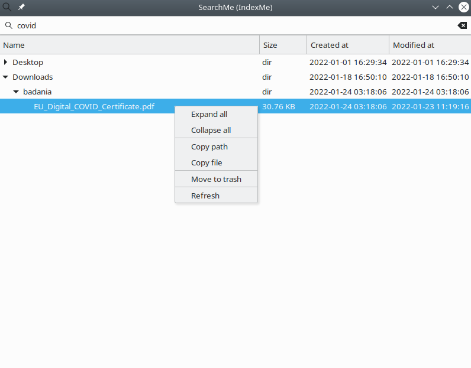

# IndexMe - file indexer and searcher

This is a program I made as a final project of [Advanced Python course](https://zapisy.ii.uni.wroc.pl/courses/kurs-rozszerzony-jezyka-python-202122-zimowy).

## Why are file indexers useful?

- a more user-friendly replacement for unix `find` / `locate`
- searching a directory doesn't require traversing it, just reading from a database (Gnome Nautilus integrates with Gnome Indexer for that reason)
- backup utilities can quickly get a list of all recently changed files instead of making it themselves (I heard some backup programs for macOS use Spotlight's database (md) so they don't need to traverse whole user directory every day)

## Features

- option to index a directory or watch it for changes (`inotify`)
- many filters to use
- exclusion lists (don't index `node_modules`!)
- integration with xargs
- dealing with I/O failure
- GUI for searching



## Installation

```bash
sudo apt install xclip libgirepository1.0-dev
git clone git@github.com:pzmarzly/uni-project-file-indexer.git
cd uni-project-file-indexer
pip3 install --user .[gui]
```

## Example usage

```bash
# Indexes home directory, excluding some directories.
indexme ~ --exclude .git --exclude node_modules --exclude .cache

# Lists all indexed files.
searchme '' /

# Finds all PDF invoices in ~/Downloads.
searchme invoice ~/Downloads --extension pdf --no-directories

# Opens a search window. Upon selecting a file, path is copied to clipboard and program quits.
searchme-gui ~ --print --exit | tr -d '\\n' | xclip -selection clipboard

# Interactively copies images to clipboard.
searchme-gui --extension png --print --xargs | xargs -0 -L 1 xclip -selection clipboard -t image/png -i
```

## How expensive is it?

```bash
$ indexme ~ > log.txt
Time: 0h:14m:19s
$ wc -l log.txt
1180309
$ ls -lh ~/.local/share/indexme.sqlite3
-rw-r--r-- 1 pzmarzly pzmarzly 443M sty 15 12:58 /home/pzmarzly/.local/share/indexme.sqlite3
```

The running time could be improved greatly if I used raw `sqlite3` library instead of `SQLAlchemy`.
